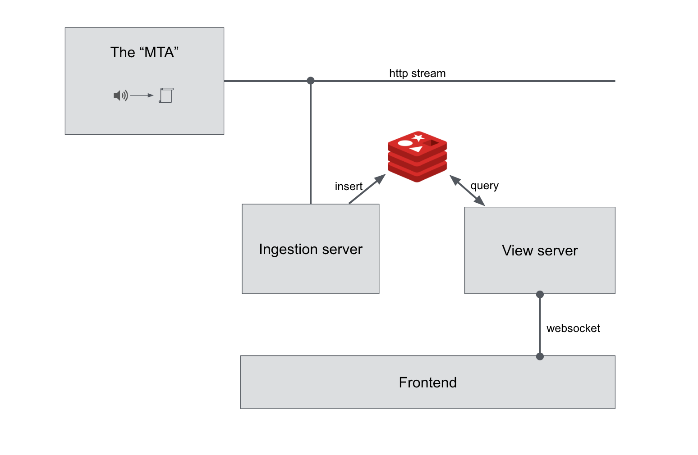

# Subway Sounds

This repository contains code for the real-time story Subway Sounds, completed for the class Storytelling with Streaming Data at Columbia University in Spring 2016.

## Dependencies

### System dependencies

This project has two non-standard dependencies:

- [Redis](http://redis.io/)
- [websocketd](http://websocketd.com/)

Please install these before attempting to run this locally. This project was developed using Redis version 3.0.5 and websocketd 0.2.11. We cannot guarantee compatibility with other versions of these software packages, although we use relatively basic funcionality from both, so it should be fairly tolerant to different versions.

### Python dependencies

The Python dependencies are listed in `requirements.txt`. You can install them in one go using the following command:

```
pip install -r requirements.txt
```

## Folder Structure
```
├── 0_streaming_server
│   ├── analysis
│   │   ├── A_weighting.py
│   │   ├── calibration.py
│   │   ├── day1
│   │   │   └── processed-data
│   │   │       ├── 1_street.WAV.json
│   │   │       ├── 2_concourse.WAV.json
│   │   │       ├── 3_1-2-3.WAV.json
│   │   │       └── 4_7.WAV.json
│   │   ├── day2
│   │   │   └── processed-data
│   │   │       ├── 1_street.WAV.json
│   │   │       ├── 2_concourse.WAV.json
│   │   │       ├── 3_1-2-3.WAV.json
│   │   │       └── 4_7.WAV.json
│   │   ├── generate_data.py
│   │   ├── spl.py
│   │   └── wavio.py
│   ├── graphs
│   │   ├── recalibration\ with\ A-Weights.png
│   │   ├── x.png
│   │   ├── y.png
│   │   └── z.png
│   ├── playback.py
│   └── server.py
├── 1_ingestor
│   ├── ingest.py
│   └── store.py
├── 2_view_server
│   ├── 90
│   ├── trains.py
│   └── viewserver.py
├── 3_frontend
│   ├── chart-test.html
│   ├── css
│   │   └── main.css
│   ├── index.html
│   ├── js
│   │   ├── chart-maker.js
│   │   ├── highcharts.js
│   │   ├── jquery-1.9.1.min.js
│   │   ├── main.js
│   │   └── update.js
│   ├── media
│   │   └── cover.jpg
│   ├── references.txt
│   ├── run_server
│   └── thoughts.txt
├── README.md
└── requirements.txt

13 directories, 38 files
```
## System structure

Here is a sketch of the system's structure:




## To Run

### Start the backend

To start the simulated MTA stream of sound intensities, use the following command.

```
cd 0_streaming_server && python playback.py | python server.py
```

### Start the ingestor

**Note**: before you start the ingestor, make sure you have started the Redis server and that it is serving over the default port. The below commands must be run from the root directory. 

```
cd 1_ingestor && python ingest.py | python store.py
```

### Start the view server

Run the following command to start the view server, which is a websocket pumping out updates to the stream.

```
websocketd --port 6999 python 2_view_server/viewserver.py
```

### Start the frontend

Finally, you can start the front-end server using the following command.

```
cd 3_frontend && ./run_server
```

Navigate your browser to localhost:8000 to view the story, updating in (simulated) real time.
